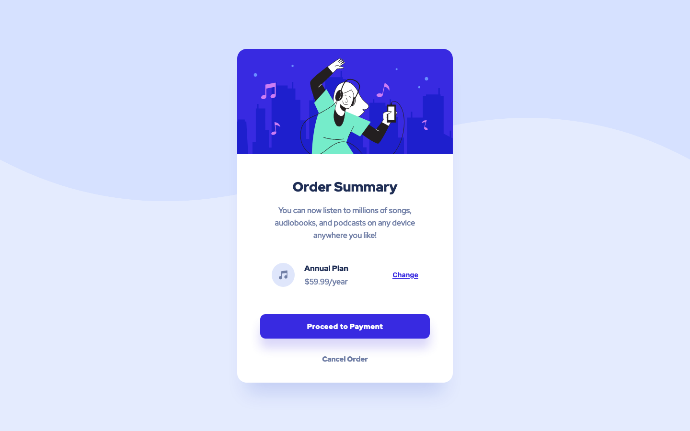

# Order summary card solution

This is a solution to the [Order summary card challenge on Frontend Mentor](https://www.frontendmentor.io/challenges/order-summary-component-QlPmajDUj).

## Table of contents

-   [Screenshot](#screenshot)
-   [Links](#links)
-   [Built with](#built-with)
-   [Author](#author)

## Screenshot

## Links

-   [Solution URL](https://github.com/ionStici/order-summary-component)
-   [Live Site URL](https://ionstici.github.io/order-summary-component)

## Built with

-   Semantic HTML5 markup
-   Flexbox

## Author

-   [GitHub](https://github.com/ionStici)
-   [Frontend Mentor](https://www.frontendmentor.io/profile/ionStici)
-   [Twitter](https://twitter.com/ionStici_)

<!-- ## Front-end Style Guide
- Pale blue: hsl(225, 100%, 94%)
- Bright blue: hsl(245, 75%, 52%)
- Very pale blue: hsl(225, 100%, 98%)
- Desaturated blue: hsl(224, 23%, 55%)
- Dark blue: hsl(223, 47%, 23%)
- Font size (paragraph): 16px
- Family: [Red Hat Display](https://fonts.google.com/specimen/Red+Hat+Display)
- Weights: 500, 700, 900 -->
